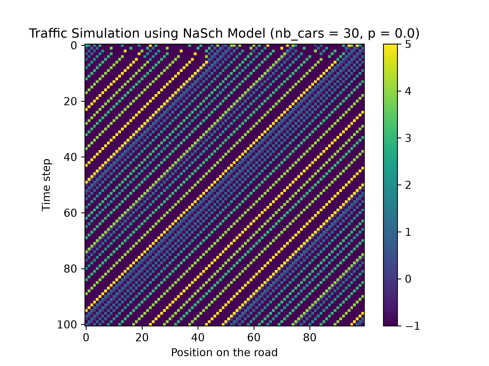
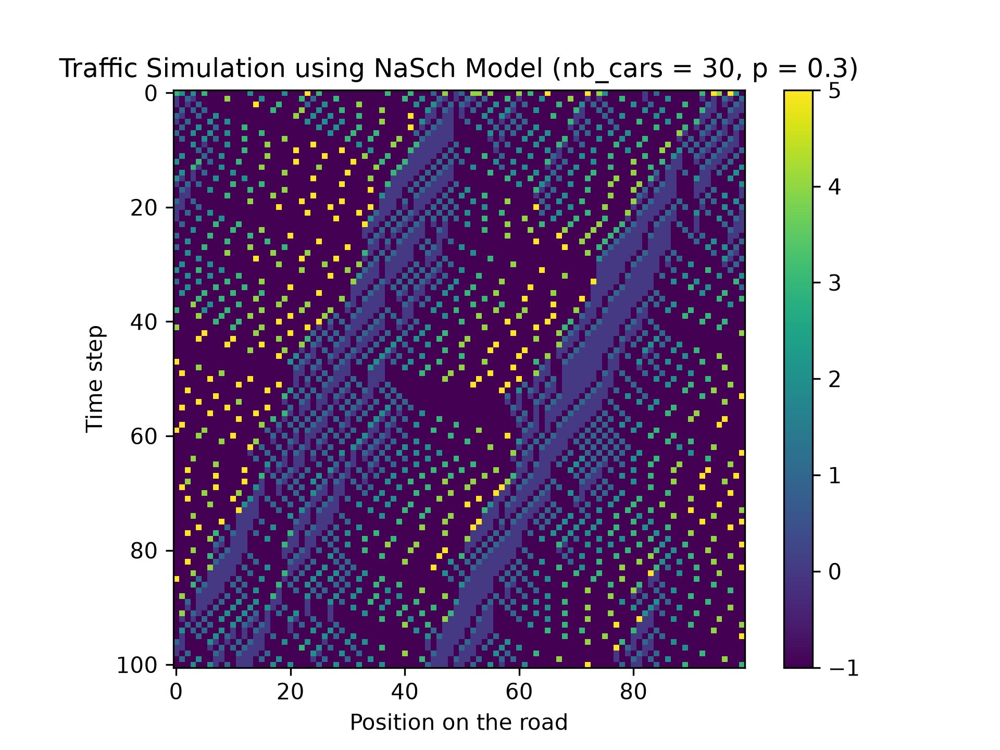
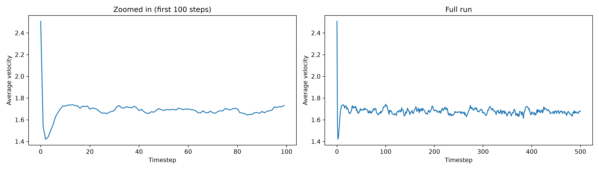
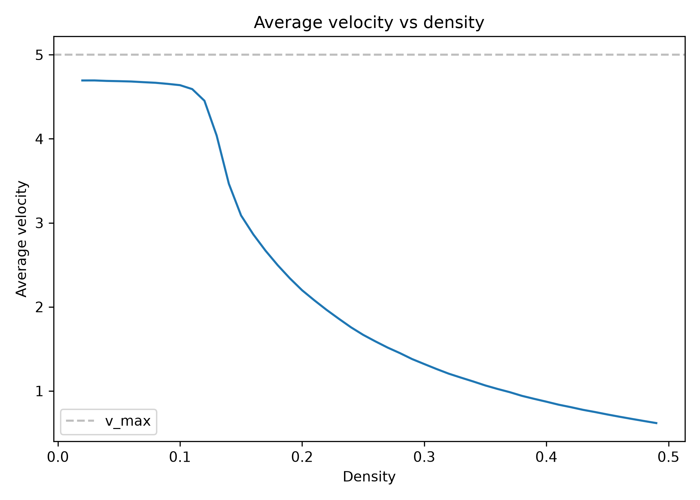
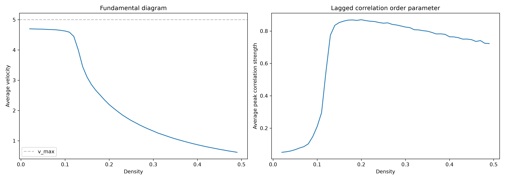
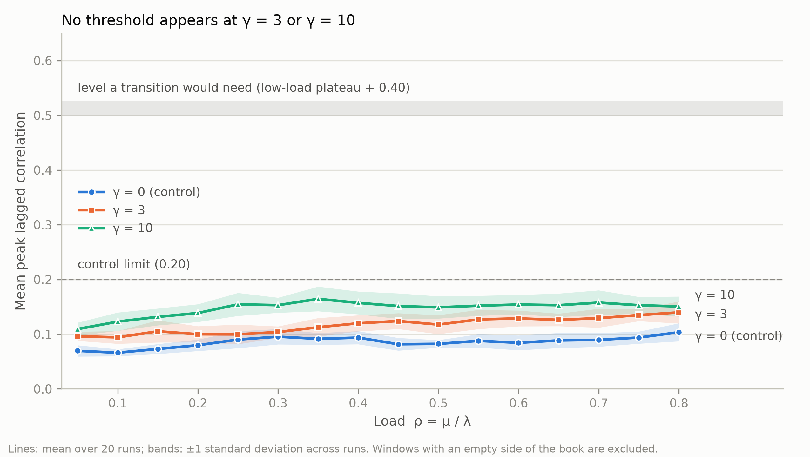

# Phantom Traffic in Financial Markets

A study of how phantom traffic jams emerge spontaneously from pure randomness in a cellular automaton model of traffic, and an exploration of whether the same critical-threshold applies to financial markets.

## Motivation

One day, before entering a market to buy groceries, I noticed that a small car had randomly slowed down to a stop in the middle of the road, causing the cars behind it to slow down as well. I didn't think much of it until, when I left the market, I was met with a full blown traffic on all four roads of the intersection. I couldn't have possibly been sure that it was caused by this small Renault, but one can always theorize.

When looking at financial markets, we often see parallels with cars on a road. There are gaps between cars and gaps between 'bids' and 'asks'. Too many cars on the road can lead to traffic, just like how too many orders might lead to long waiting times for orders to be fulfilled. A large highway can better accommodate for an influx of vehicles, much like how a 'deep' order book can handle massive trades without moving much.

As such, it is perhaps quite logical to wonder what happens if the financial market's equivalent of a random sudden stop were to occur. What happens when a large market order suddenly disrupts the market and perhaps more importantly, given hypothetical circumstances, how large of a disruption can a market absorb?

## Phase 1 : Traffic simulation (Nagel-Schreckenberg model)

#### The Model

A 1D cellular automaton on a ring : vehicles occupy cells on a looping track, each with a randomized initial integer velocity (between 0 and 5). Following Nagel-Schreckenberg's model, at every timestep, all vehicles update via four rules : acceleration, braking (relative to the gap ahead), random slowdown (with probability p), and movement.

In order to study the limits of such a model, notably at what point do cars cause too much propagating traffic, we need to isolate density $\rho = N/L$ as our clean control parameter, hence why we used a ring, not an open road. This also mirrors Sugiyama's famous 2008 experiment which demonstrated that traffic jams can form with no obstacle and no new additions of vehicles.

#### Verifying the base simulation

Before trusting proceeding statistical measurements, the simulation was first validated with two scenarios. First, if $p = 0$, the simulation would be entirely deterministic, vehicles would move at fixed speeds after accelerating to the maximum velocity. 

Setting $p = 0.3$, we obtain a graph which show the propagating stop-and-go effect that you can expect from the Nagel-Schreckenberg model.

#### Choosing the burn-in grace period

Considering the random nature of each vehicle's assigned velocity, it is perhaps wise to do our statistical measurements after a given grace period for it to reach its steady-state behavior. To do this, we can model the average of the average velocity at the vehicles on the road at each timestep for a large number of simulations, thus giving us a more accurate idea of when the transient is resolved, as one single simulation, affected by randomness, can not possibly be representative.

We observe that the transient resolves within approximately the first 15 steps. We can confirm this by calculating the average velocities between 15-30, 30-100 and 200-400 to determine that they are very close.

#### Average Velocity vs Density

Sweeping density $\rho = N/L$ (by varying vehicle count $N$ for a fixed track length $L$) and measuring post grace-period average velocity, averaged across 50 independent runs per density for more reliable data, we have the following graph of the average velocity as a function of density.

#### Limitation

Average velocity dropping is consistent with phantom jam formation but it does not allow us to directly graph the propagating stop-and-go waves that we are looking to observe both on the roads, and in the financial markets. Notice that, by looking at the graph of velocity over the time steps, we can indeed deduce that this stop-and-go effect happens. Even after the transient state, the average velocity would appear to fluctuate a lot, suggesting that vehicles slow down, causing traffic, before speeding up and repeating this cycle.

That said, in order to properly model this propagating stop-and-go effect and determine the threshold for which the density of the road dramatically increases the effect, we would need a statistical measurement that would capture a vehicle's behavior in comparison to the one in front of it, a statistical measurement that tells us how 2 objects change relative to one another, like the Covariance...

#### Lagged-Correlation Measure

If a vehicle brakes, then after a certain time interval, the vehicle behind it would brakes too, which causes the one behind it to brakes, etc... This is the propagation effect that we can see thanks to the waves in the graph of the NaSch simulation. Using the covariance, we are able to precisely capture how a vehicle's change in speed affects adjacent vehicles' change in speed. The key here is that we are offsetting the following vehicle's speed data by a few time interval as it doesn't update instantaneously as per the rules of our simulation. As well, the covariance can vary a lot from one pair of vehicle to another, depending on various factors. As such, normalizing the covariance between -1 and 1 by taking the correlation coefficient between pairs of vehicles allow for a much easier understanding of this statistical measure.

Just like for the average velocity, in order to determine the density threshold of our model, we sweep through different numbers of cars on the road, therefore different densities, with many iterations per density to average out any statistical anomaly due to the probabilistic nature of our model, and calculate the correlation strength for each run. As we intend to use this measure further down, we'd want to be precise on what the critical density $\rho_c$ is, and what the confidence interval for $\rho_c$ is. To determine $\rho_c$, we actually use a neat method that I learned from Chemistry. 

During a titration, in order to determine which volume of the titrating solution was necessary to entirely consume the solution that is being titrated, we can rely on many methods and in particular, the one I enjoyed the most, was pH-level monitoring. The critical volume corresponded to the volume at which the pH of the solution jumped the most. Mathematically, this is when the derivative of $pH = f(t)$ is an extremum. We do the same in order to determine what the critical density is. Thanks to my training in competitive High School Chemistry, looking at the graph and the sweeping, it mirrored a titration so conveniently that using this to determine $\rho_c$ was almost instinctive.

In order to determine the confidence interval, we can simulate different runs by randomly choosing 50 of the 50 independent runs per density. Of course, this would imply that an independent run can be repeated, otherwise it would be the same 50 independent runs from the beginning. We then determine $\rho_c$ with this new randomized set of runs, repeating this over a large number of times and taking the 2.5th percentile as our lower bound, and the 97.5th percentile as our upper bound, giving us a confidence interval of 95%. This has the notable time advantage of not having to re-simulate hundreds of time in order to determine the CI. Note that each sweep runs roughly 2400 simulations which takes roughly 2 minutes to compute. We ran 500 simulated independent runs to determine CI, if we had to do the sweep again every single time, that is a lot of minutes!

The following graph is what we obtained thanks to our sweeping.

We have $\rho_c = 0.115$ and $CI = [0.115,0.125]$

## Phase 2 : From traffic to the order book

Phase 1 gave us a tipping point: below $\rho_c$ cars barely influence one another, and above it a slowdown ripples backwards through the traffic. Phase 2 asks whether a simulated limit order book shows the same kind of tipping point when liquidity providers react to one another.

#### The simulated order book

A single-asset limit order book with integer price ticks, a FIFO queue at each price (price-time priority), and limit, market and cancel orders. After every operation, we check the book's invariants (no crossed book, no empty price levels, volume conserved), and the matching engine is tested against a deliberately naive reference implementation on thousands of random events. Events arrive at random: limit orders at rate $\lambda$, market orders at rate $\mu$, and each resting order is cancelled at rate $\theta$.

#### Mapping traffic onto the order book

| Traffic | Order book |
|---|---|
| cars | price levels, ranked by distance from the best price (level 0 is the touch) |
| car speed | change in depth at a level over a window of 50 events |
| density $\rho = N/L$ | load $\rho = \mu / \lambda$ : market orders (taking liquidity) per limit order (providing it) |
| random slowdown | baseline random cancellations |
| braking behind a slow car | withdrawal of liquidity behind a level that was just pulled |

In our traffic simulation, more cars meant a fuller road whereas in the book, a higher load means thinner depth. Despite this, the two systems share very little room for slack at their respective extremes.

#### The coupling

Much like how one car's speed is related to the speed of the car that's in front of it, we also need a way to link one level to the next, or they would just be independent, giving us no propagation. For this, we can measure a $\text{stress}$ that is built up when a certain amount of order volume at a price is cancelled. This $\text{stress}$ fades over time and is measured against the depth still resting there. We then multiply the cancel rate for the orders directly behind it by $1 + \gamma \cdot \text{stress}$. This is important because it allows us to single out cancellations as that solely represents someone abandoning a position that they were holding, whereas a fill is demand.

Here, $\gamma$ is the coupling strength, the larger gamma is, the more strongly a cancellation spreads to the level behind it and $\gamma = 0$ indicates that the cancellations have no effect on each other at all.

#### What counts as a transition

We call it a transition if the average peak lagged correlation rises by at least 0.4 between low and high load, over a span of loads no wider than 20% of the range tested, and the control with $\gamma = 0$ (no coupling) does not rise above 0.20. These numbers are based on our findings from phase 1 and a pilot uncoupled book: 
- the uncoupled book's correlation sat between 0.06 and 0.12, so 0.20 is clear of the noise but low enough that a higher value would point at the measurement and not the coupling;
- the traffic rise was about 0.8 with a noise standard deviation of 0.015, so 0.4 is far above noise while allowing a weaker effect than traffic;
- the traffic transition was 8% of its density range wide, so 20% would allow a softer transition but rules out a lazy slope.

#### Results

Under the rules we wrote, for there to be a transition, the average peak lagged correlation should rise by at least 0.4. The order book sweeping with $\gamma = 3$ and $\gamma = 10$ did not show this level of transition despite the control passing.

What's important to note is that our instrument is trustworthy. It detects a cascading effect when there is one, it respects the direction that we had encoded (level 0 = touch, position k is the frontier position on each side and k+1 is the tick behind it).

We swept 16 loads(0.05 to 0.80), 20 runs each, 40000 events (with the first 5000 dropped), with levels from 0-4 and lags from 0-9 windows.

Here are the results :

| | Low plateau ($\rho<=0.20$) | High plateau ($\rho>=0.60$) | Rise | Max |
|---|---|---|---|---|
| $\gamma = 0$ (control) | 0.072 | 0.092 | +0.020 | 0.104 |
| $\gamma = 3$ | 0.099 | 0.132 | +0.033 | 0.140 |
| $\gamma = 10$ | 0.126 | 0.154 | +0.028 | 0.165 |

The rises are well below the required +0.40. The largest step between adjacent loads is +0.016, whereas in our traffic simulation we found 0.3-0.4 per step. The curves increase very slightly before quickly reach a plateau.

To understand why this happened, we counted cancellations directly. After a cancellation, the number of further cancellations at the tick behind it within a 50 events window would allow us to determine whether the cascade is self-sustained or whether it degenerates before the measurement can properly capture anything. In our case, the coupling rule only adds about 0.1 to 0.36 extra cancellations per cancellation to our control uncoupled book. For a cascading effect to be self-sustained, we could expect at least 1 cancellation per 50 event windows for the cascading effect to be sustained.

Now this could also mean that we just need to increase the coupling strength $\gamma$ which would hopefully generate more cancellations per cancellation. However, running simulations with $\gamma = 30$, $\gamma = 100$ and $\gamma = 1000$ shows not only is the increase in number of cancellations per cancellation roughly logarithmic relative to $\gamma$ but, even with $\gamma = 1000$ we peak at +0.550 compared to our control uncoupled book, still well below the +1 we'd like to see. Do note that we only checked these $\gamma$ at the event level, we did not sweep through loads with these values. 

We also chose to exclude windows where either side of the book is empty at the start or at the end, since for those windows the touch is undefined. At load 0.8, this removes 17%, 34% and 46% for $\gamma$ = 0, 3 and 10 respectively. 

#### Limitations

- The coupling is a rule we wrote. A transition would show that a detector can work *if* a market has this kind of propagation, not that real markets do, we wouldn't be able to know whether or not real order-book operate this way until we test it on actual data.
- We only tested one response mechanism : an order cancellation causes other orders to cancel, so in our order book model, the null applies to only this one mechanism, we'd need to test other forms of response mechanism to see whether or not this applies to them as well.
- Our order-book model itself is beyond simplistic : memory-less symmetric Poisson order flow, a drift-less random-walk price, event time instead of clock time, a single asset, and subjective measurement choices (5 levels, 50-event windows), though this last one is also limited by compute time.
- Excluded windows are the thin ones, the highly stressed ones, so at high load the curves describe calmer moments and a transition concentrated in the excluded moments would be missed. This design choice was however necessary as the current design model does not know how to properly handle situations where the touch is empty.
- Coupling also thins the book (as cancellations are more frequent). To be more precise, it is roughly 30%-70% thinner than the control's volume, so a gap between coupled and control is caused both by propagation but also by the difference in depth.

## Possible pursuits

The original idea behind this project after building the lagged-correlation measurement for our traffic system was to see whether or not we can exploit this mechanism for early detection of disruptions in a financial order book. My desire to see whether or not this would hold still exists but unfortunately my model did not reproduce the transition effect, and due to the simplistic nature of my model, I can not tell if it is because the model is too simple or because the effect is absent. The only way to truly know if this is possible is to apply the methods directly to real-data order books, but that would imply working with a much more complex multi-asset, clock time based system... definitely a task for the upcoming future!